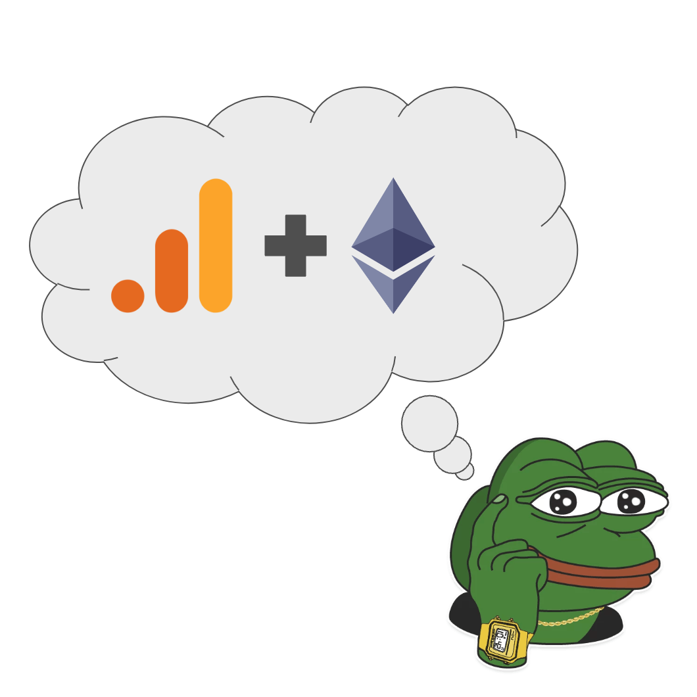
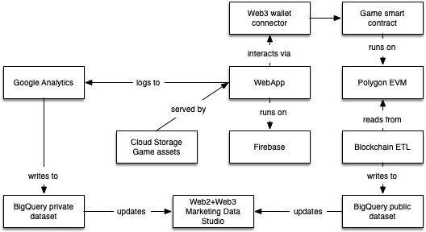

# web3-analytics-demo



## Overview

It is inevitable for Web2 and Web3 to co-exist, making it essential for us to 
have a good understanding on how to leverage existing web2 toolings such as 
Google Analytics and BigQuery which gives users access to Web3 analytics and 
combine it with Web3 tools such as Web3Auth/Metamask for user authentication to 
easily create dApps and extract user analytics and data needed for the growth 
of applications. 

This repo contains a simple web3 game. The purpose of the game is to
demonstrate how to integrate Google Analytics with a web3 dApp for the purposes
of game optimization.

## Prerequisities

* Set up a [Google Analytics](https://analytics.google.com/) *version 4*
property and have its tracking ID handy. The tracking ID looks like
`G-XXXXXXXXXX`.

* Set up a Google Cloud project and enable [Google
  AppEngine](https://cloud.google.com/appengine).

* Install the [Google Cloud SDK](https://cloud.google.com/sdk) - you'll need
  the `gcloud` command-line interface.

* NodeJS NPM - you'll need the `node` and `npm` command-line interface.

## Game details

The game is simple. On page-load, two NFTs from a collection (preconfigured)
appear side by side, and the player can click either of them. The clicked item
receives `+1` points, and the unclicked item receives `-1` points. Two new NFTs
are selected at random, and the gameplay continues.

There are three possible things that can happen during gameplay, related to the
web3 wallet status.

### Data collection modes

1. If the user doesn't have - or has not connected - a web3 wallet, gameplay
events are logged to Google Analytics like an ordinary web2 game.
2. If the user has connected a web3 wallet, events are logged to Google
Analytics along with the user's web3 wallet address.
3. As a variant of (2), when a web3 wallet is connected the user can
optionally to have their vote recorded on-chain.

### Game components



The game consists of 3 custom-made parts:

Deployment of game on either 
* [Appengine](./appengine) or [Firebase](./appengine)  - HTML/CSS/JS assets for the client-side game logic 
* [Solidity](./solidity) - Solidity assets for the on-chain game logic (simply
  keeps track of wins/losses per NFT)
* [Bigquery](./bigquery) - SQL queries for analyzing game play data. This
  requires the deployment's linked Google Analytics property to have BigQuery
  export enabled. The example [combined.sql](./bigquery/combined.sql) leverages
  the Polygon public dataset in BigQuery to join Google Analytics events with
  on-chain events where possible (see game mode 1, above).
  
If your expertise lies in another Cloud Provider, refer to [this](https://cloud.google.com/free/docs/aws-azure-gcp-service-comparison) documentation to see equivalent services and comparisons in Microsoft Azure and Amazon Web Services.

## Setup

This example will assume you already have a project created where you wish to set up these resources and will follow the steps for that.  If you would like for the project to be created with the rest of the architecture please refer to the below instructions.

### Prerequisites

* Have an [organization](https://cloud.google.com/resource-manager/docs/creating-managing-organization) set up in Google cloud.
* Have a [billing account](https://cloud.google.com/billing/docs/how-to/manage-billing-account) set up.
* Have an existing [project](https://cloud.google.com/resource-manager/docs/creating-managing-projects) with [billing enabled](https://cloud.google.com/billing/docs/how-to/modify-project), we’ll call this the __service project__. You can choose to either deploy the game on Google AppEngine or Firebase. More information on deployment below.
* Install the [Google Cloud SDK](https://cloud.google.com/sdk) - you'll need
  the `gcloud` command-line interface.
  
* NodeJS NPM - you'll need the `node` and `npm` command-line interface.

### Roles & Permissions

In order to spin up this architecture, you will need to be a user with the “__Project owner__” [IAM](https://cloud.google.com/iam) role on the existing project:

__Note__: To grant a user a role, take a look at the [Granting and Revoking Access](https://cloud.google.com/iam/docs/granting-changing-revoking-access#grant-single-role) documentation.

### Deployment

#### Step 0: Cloning the repository
Cloning the repository 
Click on the button below, sign in if required and when the prompt appears, click on “confirm”.

[<p align="center">  </p>](https://ssh.cloud.google.com/cloudshell/editor?cloudshell_git_repo=https://github.com/allenday/web3-analytics-demo.git)

#### Step 1: Set up and deploy resources 

#### Google Analytics 4
  
Set up Google Analytics for your app by creating a [Google Analytics 4 property and adding a data stream](https://support.google.com/analytics/answer/9304153?hl=en&ref_topic=9303319). 

* Find the measurement ID, Google Analytics 4 properties have an ID that starts with "G-" instead of a Tracking ID (GA3) that starts with "UA-. [How to find it](https://support.google.com/analytics/answer/9539598?hl=en)
* Replace gtag measurement ID in index.html 
// Need to reformat the walletID output 
* Capture wallet address as a GA event, this can be found under real-time reports/ Events on vote_hit > wallet 

#### Working with NodeJS / Google AppEngine

```
cd appengine
gcloud config set project your-project-name

# install node dependencies
npm install

# run a local dev server on $PORT (default 3000)
#npm run start

# deploy to appengine
npm run deploy
```

#### OR working with deploying on Firebase 

In the [Firebase console](https://firebase.corp.google.com/u/0/), you can create a Firebase project to your existing Google Cloud project and optionally set up Google Analytics for your Firebase project. You can read more [here](https://firebase.google.com/docs/hosting/?authuser=0&hl=en) and follow the below steps once your Firebase project is created. 

* Set up [Firebase authentication](https://firebase.google.com/docs/auth): Add sign-in method eg, Google or custom providers. For this demo purpose, select Google and click enable. 
* Set up Node.js and install Firebase CLI 
* Configure Firebase for Web: Add Firebase SDK and take note of your domains firebase config 

#### Setting up Web3Auth 
To integrate Web3Auth with Firebase, you would need to follow the below steps. Read more on this [guide](https://web3auth.io/docs/guides/firebase) under setup your Web3Auth Dashboard section 

* Create project from Plug and Play on [Web3Auth Developer Dashboard](https://dashboard.web3auth.io/). We will be deploying the game on the Polygon mainnet. It's inexpensive to deploy a contract, and the dataset is free to query. 
* Select blockchains you will be building the project on and whitelist domain which project will be hosted. Get Web3Auth clientID from Plug and Play dashboard 
* Creater verifier from Custom Auth Section of the [Web3Auth Developer Dashboard](https://dashboard.web3auth.io/) by folllwing the guide and take note of verifier name.
* Replace web3auth config clientID in config.js file 
* Replace firebase config in config.js file 
* To initialise the Openlogin Adapter, in the web3auth.js file - replace Web3Auth adapter details with verifier details under Custom Auth dashboard eg, network verifier was deployed on, name of verifier, type of login. 

Finally, for Firebase hosting setup, 
* Initialize your project with `firebase init` in the appengine folder 
* Deploy your site: Run `firebase deploy`

### Deploying on-chain

If you're interested to combine Google Analytics data with on-chain data, I
recommend you deploy to Polygon mainnet. It's inexpensive to deploy a contract,
and the dataset is free to query. Find the [Polygon Public Dataset in Google
BigQuery](https://console.cloud.google.com/marketplace/product/public-data-finance/crypto-polygon-dataset?project=public-data-finance) (`public-data-finance:crypto_polygon`)

Note the address at which your contract was deployed and set an environment variable, like:

```
export GTAG_ID=G-XXXXXXXXXX
export CONTRACT_ADDRESS=0x00000000000000000000000000001234
export TOKEN_ADDRESS=0x00000000000000000000000000002345
```

These will be used when you run `npm run build`

#### Metamask integration - Deploy the smart contract 

You can use various Solidity IDEs eg, [Remix](https://remix-project.org/), [Hardhat](https://hardhat.org/) to deploy the smart contract in the TokenVotes.sol file. Once you have compiled the smart contract, select injected provider - metamask as your environment and deploy on Polygon mainnet. 

TODO
- capture ABI to index.html

### Analytics

If you're interested to combine Google Analytics data with on-chain data, it is recommended to deploy to Polygon mainnet, the dataset is free to query. Find the [Polygon Public Dataset in Google BigQuery](https://console.cloud.google.com/marketplace/product/public-data-finance/crypto-polygon-dataset?project=public-data-finance) (`public-data-finance:crypto_polygon`)

#### Merging Google Analytics data with Crypto Public Datasets

* To enable Google Analytics to BigQuery streaming - in Google Analytics, head to admin > under product links > select BigQuery Links > complete linking to your BigQuery project. Read more on [GA4 BigQuery streaming export here](https://support.google.com/analytics/answer/9823238#step3&zippy=%2Cin-this-article). 

TODO - queries 
- [Polygon Public Dataset in Google BigQuery](https://console.cloud.google.com/marketplace/product/public-data-finance/crypto-polygon-dataset?project=public-data-finance) *public-data-finance:crypto_polygon*
- Google Data Studio


